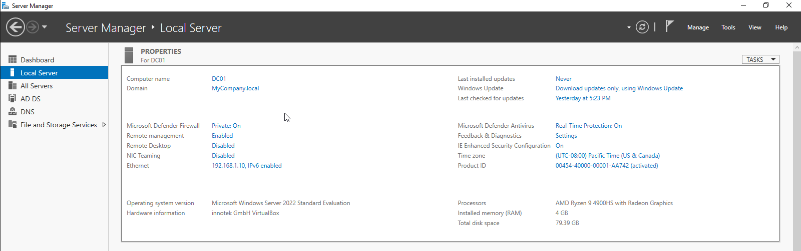
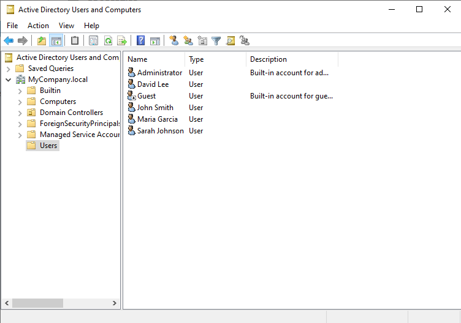
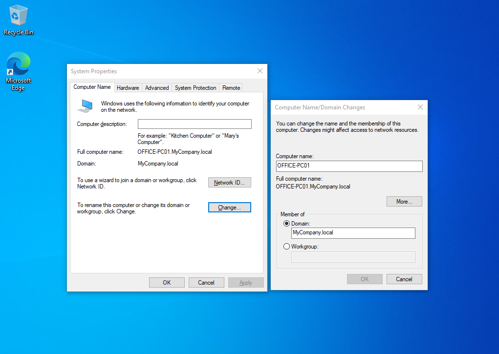
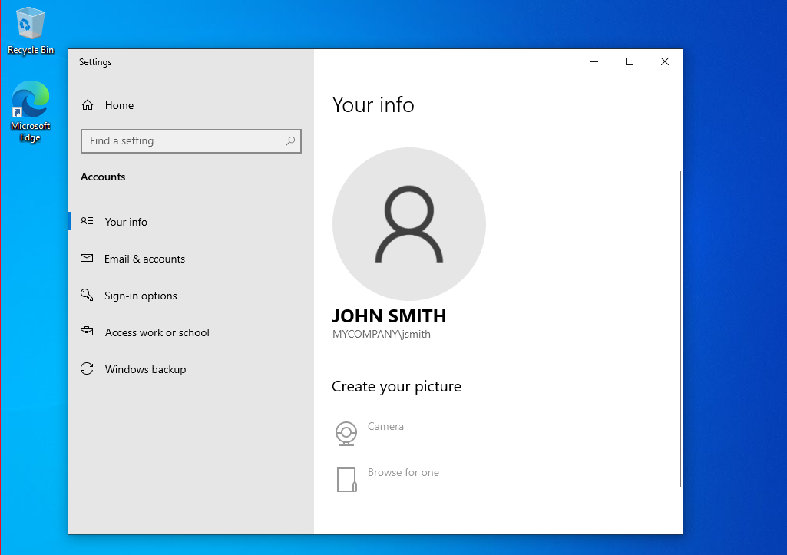
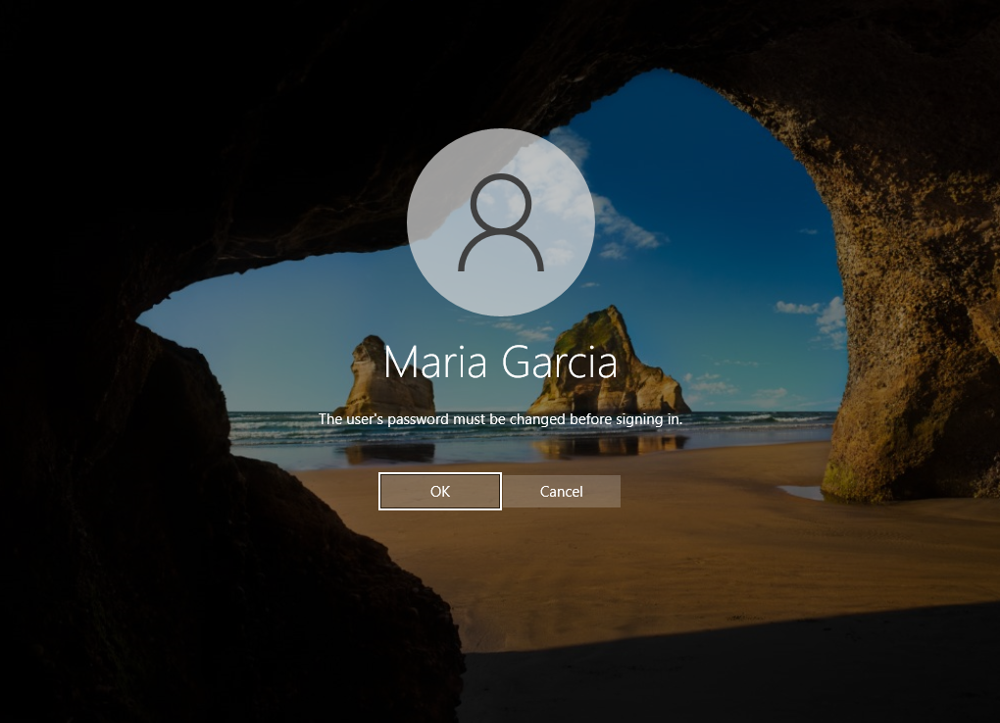
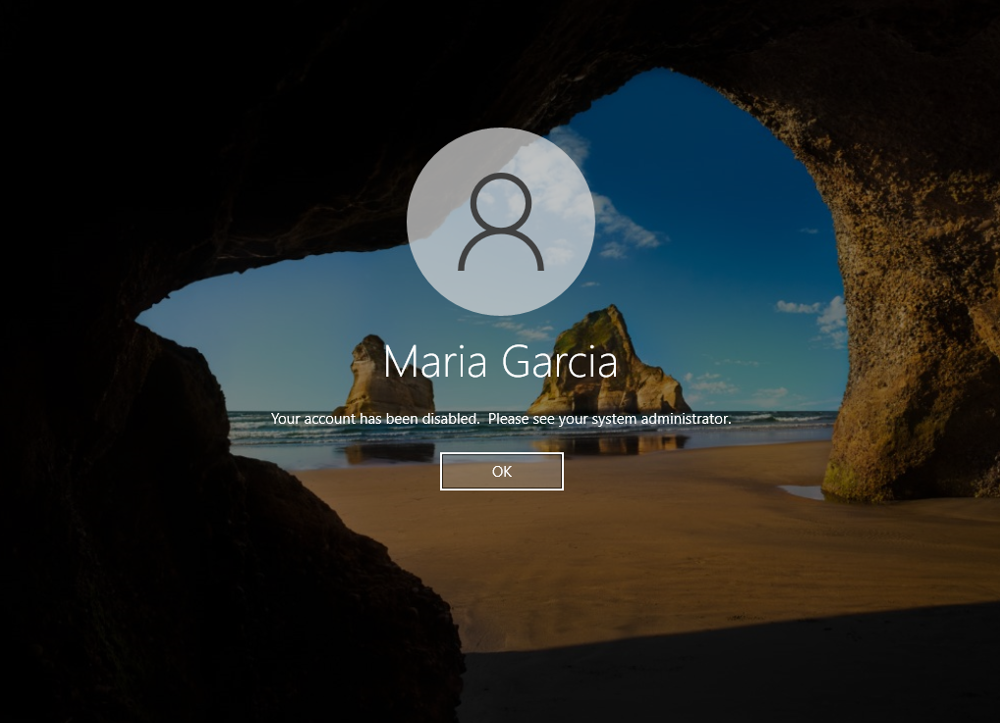

# Active Directory Homelab

## Overview

This project is a home lab where I set up a basic Active Directory environment using VirtualBox, Windows Server 2022, and a Windows 10 client.

The goal was to understand how domain environments work and practice common IT support tasks like user management, authentication, and troubleshooting.

---

## What I built

- A Windows Server 2022 domain controller
- Active Directory Domain Services
- DNS configured on the server
- Multiple domain users
- A Windows 10 workstation joined to the domain

---

## Lab setup

- Domain: MyCompany.local  
- Domain Controller: DC01  
- Server IP: 192.168.1.10  

Users created:
- jsmith
- mgarcia
- dlee
- sjohnson

---

## What I learned

- How Active Directory stores and manages users
- Why DNS is required for domain communication
- How to join a client machine to a domain
- How authentication works between a workstation and a domain controller

---

## Issue I ran into

When I first tried to join the client machine to the domain, it couldn’t locate the domain controller.

This turned out to be a DNS issue — the client was using my router instead of the server.

After changing the DNS to point to the domain controller (192.168.1.10), the domain join worked.

---

## Screenshots

### Server configuration (DC01)
This shows the domain controller setup, including the domain and IP address.

---

### Active Directory users
These are the users created and managed in Active Directory.

---

### Domain joined machine
This shows the client machine after successfully joining the domain.

---

### Logged in as a domain user
This shows a successful login using a domain account (MYCOMPANY\jsmith).

---

### Password change required
After resetting a user's password, the system required a password change at next login.

---

### Account disabled test
This shows a login attempt after the account was disabled in Active Directory.

---

## Additional tasks

- Reset user passwords and enforced password changes at next login
- Disabled and re-enabled user accounts to simulate access control
- Verified login behavior after account changes

---

## Next steps

- Creating security groups and assigning permissions  
- Setting up shared folders  
- Learning Group Policy  
