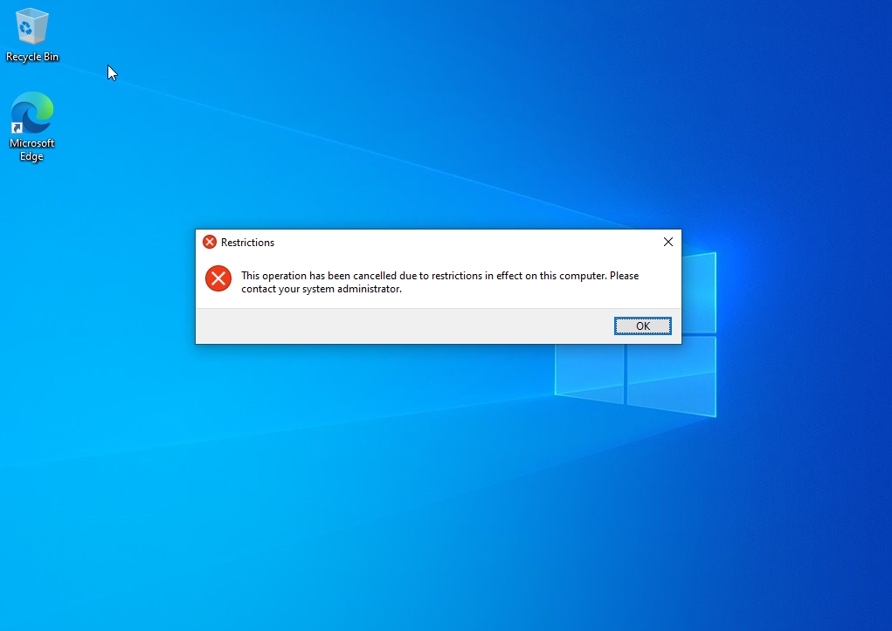

# Active Directory Homelab

## Overview

This project simulates a real-world IT support environment by deploying and managing an Active Directory infrastructure using VirtualBox, Windows Server 2022, and a Windows 10 client.

The lab focuses on **user account management, domain administration, and troubleshooting common IT support issues** such as DNS misconfigurations, login failures, and access control.

---

## What I Built

- Windows Server 2022 Domain Controller (DC01)  
- Active Directory Domain Services (AD DS)  
- DNS configured on the domain controller  
- Windows 10 client joined to the domain  
- Multiple domain users for testing authentication and access control
- Account lockout policy for security and login protection
- Group Policy Objects (GPOs) for enforcing user restrictions  

---

## IT Support Scenarios

### 1. Domain Join Failure (DNS Issue)

- **Issue:** Client machine could not locate the domain controller  
- **Cause:** Client was using router DNS instead of domain controller  
- **Resolution:** Updated DNS to point to domain controller (192.168.1.10)  
- **Result:** Successfully joined domain  

**Screenshot:**  

---

### 2. Password Reset & Forced Change

- **Issue:** User unable to log in due to forgotten password  
- **Resolution:** Reset password in Active Directory and enabled “change at next login”  
- **Result:** User successfully logged in and updated password  

**Screenshot:**  

---

### 3. Account Disabled Login Failure

- **Issue:** Login failed after user account was disabled  
- **Resolution:** Re-enabled account in Active Directory Users and Computers  
- **Result:** User regained access  

**Screenshot:**  

---

### 4. Domain User Login Verification

- **Issue:** Needed to verify domain authentication was working  
- **Resolution:** Logged into client machine using domain credentials (MYCOMPANY\\jsmith)  
- **Result:** Successful authentication confirmed domain connectivity  

**Screenshot:**  

---

### 5. Account Lockout Due to Failed Login Attempts

- **Issue:** User account locked after multiple failed login attempts
- **Cause:** Account lockout policy triggered after 3 incorrect passwords  
- **Resolution:** Unlocked account in Active Directory Users and Computers  
- **Result:** User regained access after unlock

**Screenshot:**  

---

### 6. Group Policy Restriction Applied

- **Issue:** Needed to restrict user access to system settings  
- **Resolution:** Created and applied a Group Policy Object (GPO) to disable Control Panel access  
- **Result:** User was prevented from accessing restricted system settings  

**Screenshot:**  

---

## IT Tasks Performed

- Created and managed Active Directory user accounts  
- Reset passwords and enforced password changes at login  
- Disabled and re-enabled user accounts to test access control  
- Joined client machines to the domain  
- Configured and troubleshot DNS issues affecting domain communication  
- Verified authentication and login behavior for domain users  
- Implemented account lockout policies to enhance security  
- Applied Group Policy Objects (GPOs) to enforce user restrictions  

---

## Lab Configuration

- **Domain:** MyCompany.local  
- **Domain Controller:** DC01  
- **Server IP:** 192.168.1.10  

**Users Created:**
- jsmith  
- mgarcia  
- dlee  
- sjohnson  

---

## Next Steps

- Create security groups and assign permissions  
- Set up shared folders and access control  
- Expand lab with additional client machines
- Integrate a ticketing system to simulate help desk workflows  
  
---
